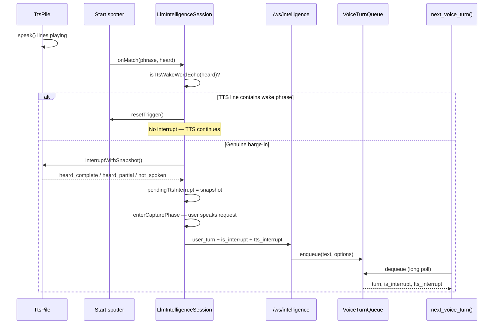

# 17 — TTS Barge-In & Wake-Word Echo Suppression

How the PWA tracks what the user heard when they interrupt assistant speech, how
that metadata reaches Cursor, and how false interrupts from TTS saying the wake
phrase are filtered out.

## Problem

Two requirements conflict:

1. **Barge-in must work** — while the assistant is speaking, the user can say the
   wake phrase to stop TTS and speak a new request.
2. **TTS must not self-trigger** — when `speak()` output includes the wake phrase
   (e.g. "Say *cursor* to interrupt"), Vosk on the mic hears speaker echo and
   fires the wake spotter.

Pausing the wake spotter during TTS fixes (2) but breaks (1). The adopted fix
keeps the spotter active and **filters echo at detection time** by comparing what
Vosk heard with what TTS is currently speaking.

See **ADR-018** in [`08-decisions-and-risks.md`](./08-decisions-and-risks.md).

---

## Components

| Layer | File | Role |
| --- | --- | --- |
| TTS queue + heard tracking | `web/src/tts-fallback.ts` (`TtsPile`) | Sequential `speak()` playback; snapshots on interrupt |
| Wake spotter | `web/src/vosk-wake-word.ts` | Grammar-restricted Vosk; passes raw `heard` text to callback |
| Echo filter + barge-in | `web/src/llm-intelligence-session.ts` | `isTtsWakeWordEcho()`, `bargeInDuringTts()`, `sendUserTurn()` |
| Phrase matching | `web/src/wake-words.ts` | `textContainsWakePhrase()`, `normalizeForWakeMatch()` |
| Snapshot types (client) | `web/src/tts-interrupt.ts` | `TtsInterruptSnapshot`, `snapshotToPayload()` |
| Snapshot types (server) | `src/voice/ttsInterrupt.ts` | `TtsInterruptContext`, `parseTtsInterrupt()` |
| Turn delivery | `src/intelligence/ws.ts` | Parses `user_turn`, enqueues with interrupt metadata |
| MCP dequeue | `src/mcp/server/turnQueue.ts`, `voiceToolHandlers.ts` | `next_voice_turn()` returns `tts_interrupt` |

---

## What the user heard — `TtsPile` bookkeeping

Each MCP `speak()` line is enqueued in `TtsPile`. While lines play sequentially,
the pile maintains three buckets used for barge-in:

| Field | Set when |
| --- | --- |
| `heard_complete` | Line finished playing (`onStart` fired, playback ended, not aborted) |
| `heard_partial` | Interrupt fired while a line was **playing** (`lineStarted === true`) — stores the **full line text**, not word-level position |
| `not_spoken` | Lines still queued, plus the current line if interrupt fired **before** `onStart` |

Playback tracking per line:

```
currentLine = text being played
lineStarted = false until TTS onStart callback
on end (not aborted) → push to completedLines
```

On interrupt, `interruptWithSnapshot()`:

1. Aborts the active line (`AbortController` + `speechSynthesis.cancel()` / Polly stop)
2. Builds `{ heard_complete, heard_partial, not_spoken }`
3. Clears the queue and marks TTS inactive

**Limitation:** `heard_partial` is line-granular. The agent is told the user heard
*some unknown prefix* of that line — not a percentage or word offset. This is
intentional; word-level sync would need playback position APIs we do not have.

---

## End-to-end barge-in flow



### Step 1 — Wake detected during TTS

`armStartSpotter()` keeps the wake Vosk **running during TTS** so barge-in works.
When Vosk matches, `onVoskStartDetected(heard)` runs.

### Step 2 — Echo filter (fix)

```typescript
// web/src/llm-intelligence-session.ts — isTtsWakeWordEcho()
voskPhraseMatches(heard, wakeWord)
  && textContainsWakePhrase(ttsPile.getCurrentLine(), wakeWord)
```

If true → `startSpotter.resetTrigger()` and **return**. No TTS stop, no
`pendingTtsInterrupt`, no capture phase, no `is_interrupt` on the next turn.

If false → real barge-in (user said wake word while TTS was saying something else).

### Step 3 — Snapshot stored locally

`bargeInDuringTts()` calls `ttsPile.interruptWithSnapshot()` and assigns the
result to `pendingTtsInterrupt`. TTS stops; the session enters utterance capture
(wake → VAD/end phrase → STT).

The snapshot is **not** sent yet — it waits for the user's transcribed request.

### Step 4 — User turn over WebSocket

When STT submits, `sendUserTurn()` attaches metadata if a barge-in occurred:

```json
{
  "type": "user_turn",
  "text": "stop and fix the auth bug instead",
  "is_interrupt": true,
  "tts_interrupt": {
    "heard_complete": ["I'm going to refactor the auth module."],
    "heard_partial": "Starting now — editing session.ts",
    "not_spoken": ["Done — three files changed."]
  }
}
```

If `snapshotToPayload()` returns empty (nothing was playing), `tts_interrupt` is
omitted even after barge-in.

### Step 5 — Bridge → MCP

`src/intelligence/ws.ts` parses the frame and enqueues:

```typescript
voiceTurnQueue.enqueue(text, { isInterrupt, ttsInterrupt });
```

`isInterrupt` is true when `is_interrupt` is set **or** `tts_interrupt` is present,
or the transcript contains stop/cancel/abort/quit (`turnQueue.ts`).

### Step 6 — Cursor receives via `next_voice_turn()`

Long-poll dequeue returns:

```json
{
  "turn": "stop and fix the auth bug instead",
  "is_interrupt": true,
  "received_at": "2026-06-19T…",
  "queue_depth": 0,
  "tts_interrupt": {
    "heard_complete": ["…"],
    "heard_partial": "…",
    "not_spoken": ["…"]
  }
}
```

The voice system prompt (`prompts/cursor-voice/system.md`) instructs the agent
how to use each field — especially not assuming the user heard a partial or
unspoken line in full.

---

## Wake-word echo suppression — decision logic

| Condition | Result |
| --- | --- |
| TTS idle; user says wake word | Normal wake → capture → submit (no `tts_interrupt`) |
| TTS playing; Vosk hears wake; **current TTS line contains wake phrase** | **Ignored** — echo from assistant output |
| TTS playing; Vosk hears wake; current line **does not** contain wake phrase | Barge-in → snapshot → `tts_interrupt` on next turn |
| TTS playing; Vosk mis-hears wake on unrelated audio | Barge-in (rare; no echo filter) |

The echo check uses **whole-word** matching (`textContainsWakePhrase`) on the
**full current TTS line** from `ttsPile.getCurrentLine()`, not playback position.

### Rejected approach

Pausing `startSpotter` in `syncCapture()` while `ttsSpeaking` prevents TTS echo
but **disables user barge-in** entirely. Do not reintroduce without a separate
barge-in path (e.g. AEC-only STT).

---

## Agent guidance (prompt contract)

On `is_interrupt: true`, Cursor should:

| `tts_interrupt` field | Agent assumption |
| --- | --- |
| `heard_complete` | User heard these lines in full — safe to reference |
| `heard_partial` | User heard an unknown prefix of this line — do not quote the rest |
| `not_spoken` | User never heard these — re-state anything important |

Also stop running workers on barge-in (`stop_agent`) before handling the new request.

---

## Clearing state

| Event | Effect |
| --- | --- |
| `sendUserTurn()` | Consumes and clears `pendingTtsInterrupt` |
| `turn_complete` (from bridge) | Clears `pendingTtsInterrupt`; `ttsPile.resetHeard()` |
| Echo ignored | No snapshot created; spotter trigger reset only |

---

## Related docs

- [`06-voice-audio-webrtc.md`](./06-voice-audio-webrtc.md) — audio pipeline overview
- [`16-mcp-server-cursor-as-brain.md`](./16-mcp-server-cursor-as-brain.md) — §8.1 turn queue, §8.7 echo filter
- [`14-prompts.md`](./14-prompts.md) — barge-in instructions in system prompt
- [`08-decisions-and-risks.md`](./08-decisions-and-risks.md) — ADR-018
